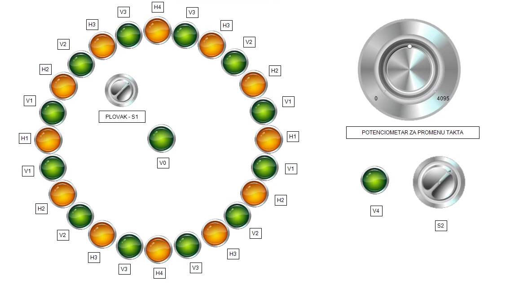

# Fountain with lights
## Work methods
The fountain works in 2 modes. Each mode lasts 60 seconds and the cycle must be completed. The working hours of the fountain are on weekdays from 17:00 to 23:00 and on weekends from 20:00 to 02:00. The clock speed is regulated by a potentiometer connected to the analog card. Regulation is carried out for 1-5s. When the float signals that the water level in the fountain is low, the fountain is filled. If the water level is lower than it should be for more than 10 seconds, the fountain shuts off. Filling the fountain is also possible manually using a switch.In the file Projektni_zadatak_gotov.project there is a leader diagram of the project and a simulation. The project was done in the CODESYS environment.
## Picture of a fountain simulation

You can watch video simulation following link:
## https://www.youtube.com/watch?v=pWIuUawerz4&ab_channel=MarkoTopalovi%C4%87
